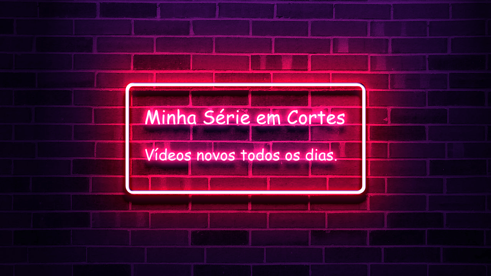

Link Minha Lérie em Cortes 

  

 

  
			<a href="https://www.tiktok.com/@minhaserieemcortes" target="_blank">
				<ion-icon name="logo-tiktok"></ion-icon>
			</a>

 

  

 

 

  

## 🚀 Tecnologias

Esse projeto foi desenvolvido com as seguintes tecnologias:

- HTML e CSS
- JavaScript
- Git e Github

## 💻 Projeto
O DevLinks é um agregador de links para usar como cartão de visitas online.

## :memo: Licença

Esse projeto está sob a licença MIT.

---